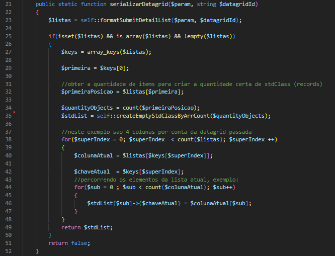

# W5ISerializador

## Descrição
Classe para automação de montagem de objetos para captura de listas da datagrid ao submeter um formulário com Adianti Framework. A ideia é simples, é basicamente a formação de uma lista de objetos do detalhe, idealmente, semelhante à model, a partir dos vetores de colunas que são recebidos como parâmetro da função geralmente chamada de “onSave”.

### Exemplo de Estrutura de Dados

#### Antes da Serialização dos Dados

#### Após a Serialização dos Dados

### Método Principal
W5ISerializador::serializarDatagrid(mixed $param, string $datagridId);

É o método que deve ser chamado da classe.

### Método Auxiliar
W5ISerializador::formatSubmitDetailList()

Na linha 23, W5ISerializador::formatSubmitDetailList() é um método que vai receber o ’$param’ que vem no ‘onSave’ e vai, a partir do id da datagrid passado como segundo parâmetro, retornar as listas com as chaves formatadas para os nomes das colunas no banco de dados.

#### Detalhamento do Método
Na linha 27, $keys tem a função de receber os nomes das colunas da datagrid e após isso, fatorar com base na datagrid. Após isso, a função vai resgatar a quantidade de itens presentes na datagrid para gerar objetos stdClass de acordo com esta quantidade, gerando uma lista destes stdClass vazios.

Após isso, na linha 38 há o preenchimento, percorrendo as colunas da datagrid e em cada uma, estabelecendo a propriedade do objeto de acordo com o nome de array_keys retornado daquela coluna, e dentro da lista da coluna em específico, outro array é percorrido, o array dentro daquela coluna, exemplo: [“nomes” => “Lucas”, “Pedro”, “Antônio”].

